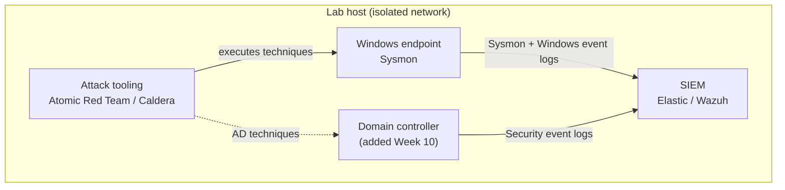

# ATT&CK Threat Emulation Lab

<!-- Optional badges: add once the Sigma validation workflow exists (Week 7)

-->

A hands-on, threat-informed defense project: emulating real adversary behavior mapped to [MITRE ATT&CK](https://attack.mitre.org), observing the resulting telemetry, writing detections, and measuring coverage against known threat groups.

> **Status:** In progress (Sep–Dec 2026). See [Progress](#progress).

---

## Summary

<!-- Fill in at the end (Week 13). Draft: -->
Built an isolated threat-emulation lab; executed [N] ATT&CK techniques and APT29 emulation scenarios using Atomic Red Team and MITRE Caldera; authored Sigma detections and produced a coverage gap analysis in ATT&CK Navigator.

## Scope and data handling

All work in this repository was performed in a personal, isolated home lab. It contains no information about any employer's systems, networks, tools, or security posture. Threat group information comes exclusively from public sources (MITRE ATT&CK, CISA advisories, and published vendor reports).

---

## Coverage at a glance

<!-- Week 9 / Week 13: replace with the final coverage heatmap screenshot -->


**Open the interactive layers in ATT&CK Navigator:**

<!-- Format: https://mitre-attack.github.io/attack-navigator/#layerURL=<URL-encoded raw GitHub link to the JSON> -->
| Layer | Description | Open |
|---|---|---|
| APT28 | Techniques attributed to APT28 | [View](#) |
| APT29 | Techniques attributed to APT29 | [View](#) |
| Overlap | Techniques shared by both groups | [View](#) |
| My coverage | Techniques I can detect in the lab | [View](#) |

---

## Results

<!-- Update as each technique is completed -->
| Technique | Tactic | Telemetry found | Detected | Rule |
|---|---|---|---|---|
| T1059.001 PowerShell | Execution | | | [link](techniques/T1059.001-powershell/) |
| T1082 System Information Discovery | Discovery | | | |
| T1087.001 Local Account Discovery | Discovery | | | |
| T1547.001 Registry Run Keys | Persistence | | | |
| T1053.005 Scheduled Task | Persistence | | | |
| T1218.011 Rundll32 | Defense Evasion | | | |
| T1003.001 LSASS Memory | Credential Access | | | |
| T1558.003 Kerberoasting | Credential Access | | | |
| T1087.002 Domain Account Discovery | Discovery | | | |

---

## Lab architecture

<!-- Week 5: update with your actual hypervisor, OS versions, and SIEM -->


| Component | Details |
|---|---|
| Hypervisor | <!-- e.g. name, version --> |
| Endpoint | <!-- Windows version, Sysmon config used --> |
| SIEM | <!-- platform, version --> |
| Emulation | Atomic Red Team, MITRE Caldera |

More detail: [lab/architecture.md](lab/architecture.md)

---

## Repository structure

```
navigator-layers/   ATT&CK Navigator layer files and screenshots
cti-mapping/        Threat reports mapped to ATT&CK, compared to official mappings
techniques/         One folder per technique: execution notes, telemetry, Sigma rule
emulation/          Caldera operation reports and the APT29 emulation scorecard
lab/                Lab build notes and architecture
writeups/           Mid-point and final write-ups
```

Each technique folder follows the same format:
1. **What I ran:** the test and how it was executed
2. **What the logs showed:** relevant events and fields, with screenshots
3. **Detection:** the Sigma rule and validation result

---

## Progress

- [ ] **Phase 1: Framework fluency:** Navigator threat layers, CTI mapping practice
- [ ] **Phase 2: Lab build:** endpoint, Sysmon, SIEM
- [ ] **Phase 3: Technique by technique:** Atomic Red Team tests and Sigma detections
- [ ] **Phase 4: Adversary emulation:** Active Directory, Caldera, APT29 emulation plan
- [ ] **Phase 5: Write-up:** final coverage analysis and lessons learned

---

## What I learned

<!-- Week 13: 3–4 honest bullets, including what didn't work or wasn't detected -->
- 
- 
- 

---

## Tools and references

- [MITRE ATT&CK](https://attack.mitre.org) and [ATT&CK Navigator](https://mitre-attack.github.io/attack-navigator/)
- [Atomic Red Team](https://github.com/redcanaryco/atomic-red-team) / [Invoke-AtomicRedTeam](https://github.com/redcanaryco/invoke-atomicredteam)
- [MITRE Caldera](https://github.com/mitre/caldera)
- [CTID Adversary Emulation Library](https://github.com/center-for-threat-informed-defense/adversary_emulation_library)
- [Sigma](https://github.com/SigmaHQ/sigma)
- [Sysmon config (SwiftOnSecurity)](https://github.com/SwiftOnSecurity/sysmon-config) / [Sysmon Modular](https://github.com/olafhartong/sysmon-modular)
- [CISA Cybersecurity Advisories](https://www.cisa.gov/news-events/cybersecurity-advisories)

## License

Original content in this repository is released under the MIT License. Third-party tools and content are referenced, not redistributed, and remain under their own licenses.
